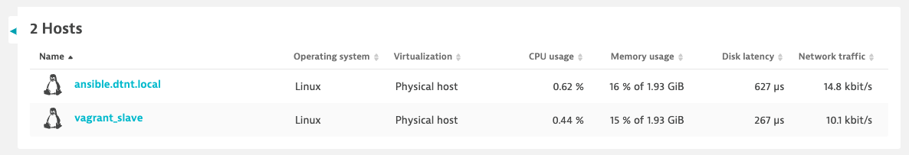

# AuditLog

I'm very disappointed. :(
No information about who created a host...

```json
{
  "totalCount": 5,
  "pageSize": 1000,
  "auditLogs": [
    {
      "logId": "169221273900020000",
      "eventType": "CREATE",
      "category": "CONFIG",
      "entityId": "builtin:user-appfw-preferences (user-john.doe@example.com): <account_id>: <no summary>",
      "environmentId": "<environment_id>",
      "user": "john.doe@example.com",
      "userType": "USER_NAME",
      "userOrigin": "rest (1.2.3.4,1.2.3.4)",
      "timestamp": 1692212737600,
      "success": true,
      "patch": [
        {
          "op": "replace",
          "path": "/",
          "value": {
            "stayOnLatestUi (Stay on the latest Dynatrace)": false
          },
          "oldValue": null
        }
      ]
    },
    {
      "logId": "1692212600030000",
      "eventType": "UPDATE",
      "category": "CONFIG",
      "entityId": "builtin:user-appfw-preferences (user-john.doe@example.com): <account_id>: <no summary>",
      "environmentId": "<environment_id>",
      "user": "john.doe@example.com",
      "userType": "USER_NAME",
      "userOrigin": "webui (1.2.3.4)",
      "timestamp": 1692212644112,
      "success": true,
      "patch": [
        {
          "op": "replace",
          "path": "/stayOnLatestUi (Stay on the latest Dynatrace)",
          "value": true,
          "oldValue": false
        }
      ]
    },
    {
      "logId": "1691246300030000",
      "eventType": "CREATE",
      "category": "CONFIG",
      "entityId": "ME_HOSTGROUP: HOST_GROUP-12345678",
      "environmentId": "<environment_id>",
      "user": "unknown",
      "userType": "USER_NAME",
      "userOrigin": "system",
      "timestamp": 1692212462727,
      "success": true,
      "patch": [
        {
          "op": "replace",
          "path": "/",
          "value": {
            "id": {
              "type": "HOST_GROUP",
              "longId": -56542696500746286
            },
            "inheritedTypes": {
              "AutoUpdate": true,
              "AgentInjections": true,
              "EventThresholds": true,
              "PluginActivations": true
            },
            "recommendedVersion": null,
            "beta": false,
            "agentInjections": {},
            "eventThresholds": {},
            "experimentalAgentInjections": {},
            "pluginActivations": [],
            "experimentalPluginActivations": [],
            "assignedLocationId": "",
            "disableDump": null,
            "diskFilterExclusionRules": [],
            "networkInterfaceFilterExclusionRules": [],
            "ipFilterExclusionRules": [],
            "disableProcessAgents": null,
            "extensionAgentActive": null,
            "ingestActive": null,
            "statsDActive": null,
            "version": 2
          },
          "oldValue": null
        }
      ]
    },
    {
      "logId": "1692217760030000",
      "eventType": "CREATE",
      "category": "TOKEN",
      "entityId": "dt0c01.123456789123456789",
      "environmentId": "<environment_id>",
      "user": "john.doe@example.com",
      "userType": "USER_NAME",
      "userOrigin": "webui (1.2.3.4)",
      "timestamp": 1692211775383,
      "success": true,
      "patch": [
        {
          "op": "replace",
          "path": "/",
          "value": {
            "tokenAuthenticableActions": "InstallerDownload",
            "actionProperties": {},
            "revoked": false,
            "expirationTimestamp": -1,
            "lastAccessTimestamp": -1,
            "creationTimestamp": 1692211775377,
            "publicIdentifier": "dt0c01.123456789123456789",
            "label": "Download Token (generated at 2023-08-16 20:49)",
            "userId": "john.doe@example.com",
            "anonymizedTokenId": "dt0c01.123456789123456789.*****"
          },
          "oldValue": null
        }
      ]
    },
    {
      "logId": "1692216140030000",
      "eventType": "CREATE",
      "category": "CONFIG",
      "entityId": "builtin:audit-log (tenant): 12341-1232-1234-1234-123456: <no summary>",
      "environmentId": "<environment_id>",
      "user": "john.doe@example.com",
      "userType": "USER_NAME",
      "userOrigin": "webui (1.2.3.4)",
      "timestamp": 1692211614726,
      "success": true,
      "patch": [
        {
          "op": "replace",
          "path": "/",
          "value": {
            "enabled (Log all audit-related system events)": true
          },
          "oldValue": null
        }
      ]
    }
  ]
}
```


